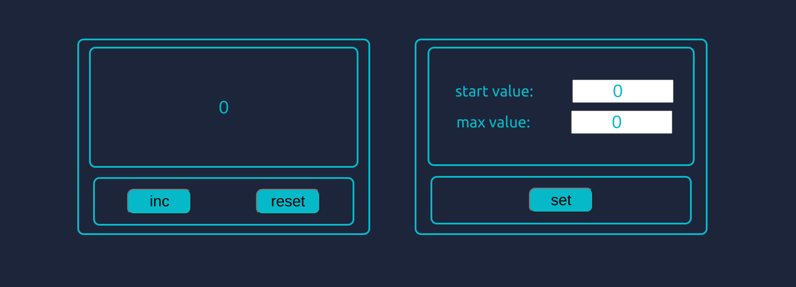

# IT-INCUATOR COUNTER 2.0

## Available Scripts

In the project directory, you can run:

### `yarn start`

Runs the app in the development mode.\
Open [http://localhost:3000](http://localhost:3000) to view it in the browser.

The page will reload if you make edits.\
You will also see any lint errors in the console.

### `hg-pages.io`

Launches the test runner in the interactive watch mode.\
See the section about [running tests](https://https://yurakholoimov.github.io/it-incubator-counter/) for more information.

